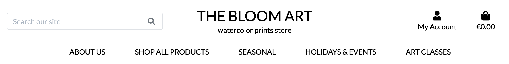
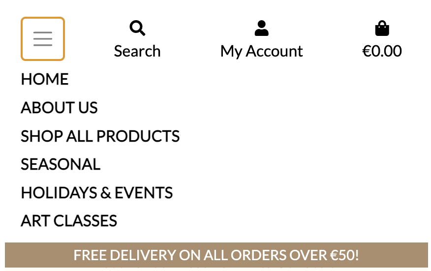
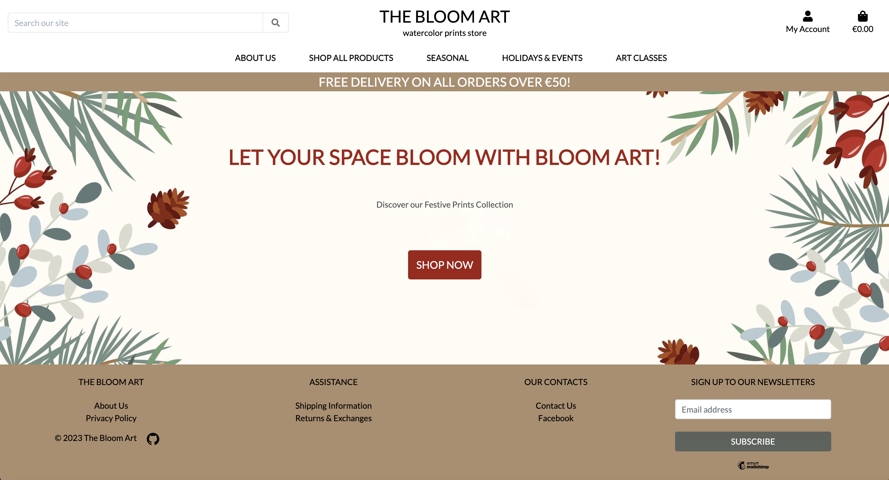
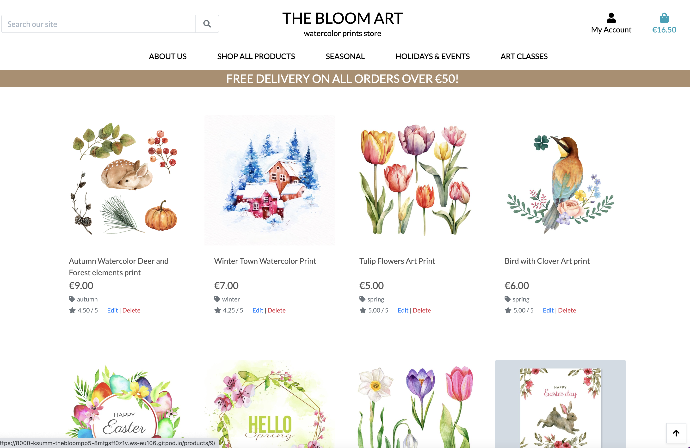
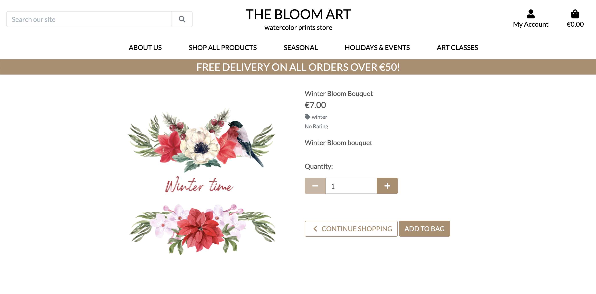
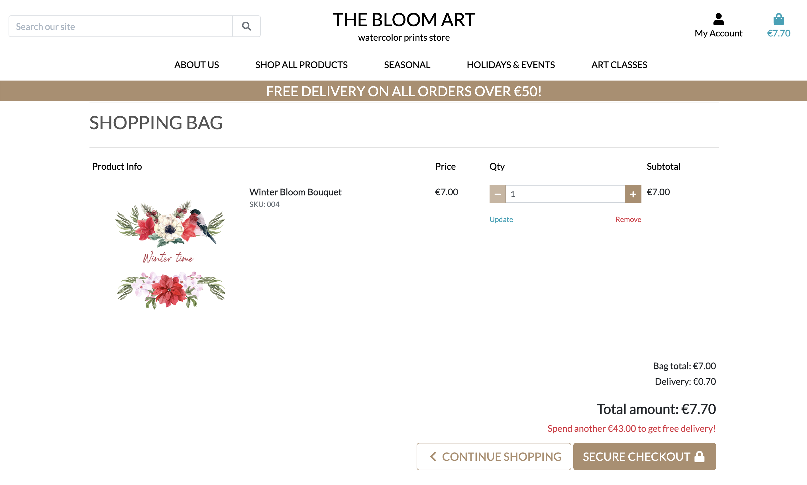
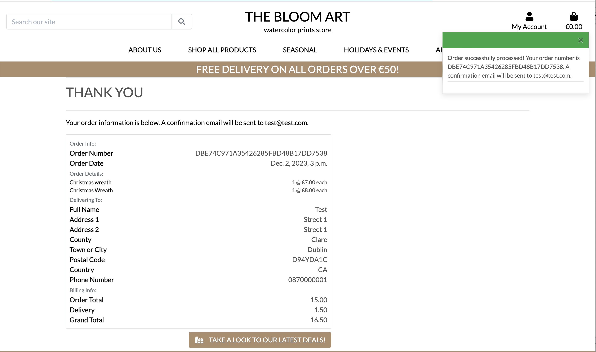
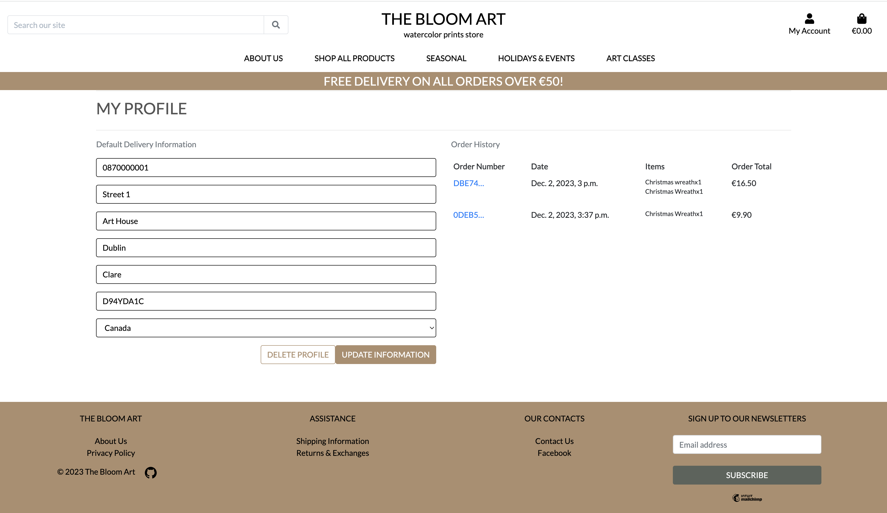
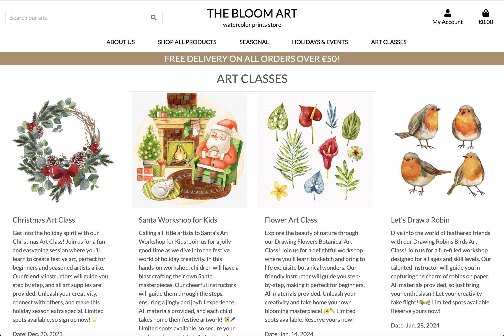
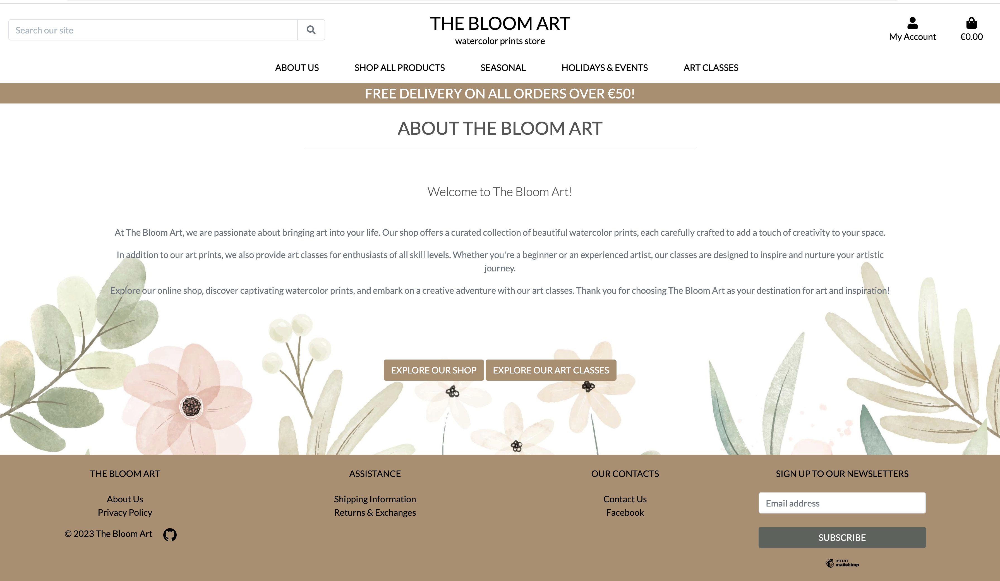

 <h1 align="center">The Bloom Art</h1>

Welcome to The Bloom Art, a vibrant and user-friendly e-commerce platform specializing in watercolor prints. This project is developed as a part of the Full Stack Development course at Code Institute. 

 [View the live project here](https://the-bloom-art-3c20c7ea337d.herokuapp.com/)

---
 

## **Table of Contents**

1. [E-commerse Business Model](#e-commerse-business-model)
2. [User Experience](#user-experience)
3. [Design](#design)
4. [Database](#database)
5. [Features](#features)
6. [Technologies Used](#technologies-used)
7. [Deployment](#deployment)
8. [Testing](#testing)
9. [Credits](#credits)

---
 

## **E-commerse Business Model**

### **Overview**
The Bloom Art E-commerce Business Model centers around providing customers with a delightful and immersive experience in the world of art. Through product sales and art class bookings - the platform aims to foster creativity and connect with a diverse community of art enthusiasts.

### **Main Goals**

**1. Discover & Decorate:**

Find and bring home stunning watercolor art prints that add a touch of beauty to your space. It's a haven for art lovers and home decor enthusiasts.

**2. Grow Your Artistry:**

Dive into our online art classes to nurture your artistic side. Bloom Art is not just a store; it's a space for you to bloom as an artist and make your personal spaces uniquely yours.

### **Revenue Streams**

1. Product Sales
   
Revenue is generated through the sale of watercolor prints available in the online shop.
Each print is priced based on factors such as size, complexity, and artistic value.

2. Art Class Bookings
   
Additional revenue is generated by offering art classes for users of all skill levels.
Customers pay a fee to participate in these classes, which can include virtual or in-person sessions.

### **Product Management**

 - Each print is categorized, has description and price.
 - The inventory is dynamic, with new prints added regularly to keep the collection fresh.
   
### **Customer Interaction**

 - The website provides a user-friendly interface for customers to explore products and classes seamlessly.
 - Intuitive navigation and a visually appealing layout enhance the user experience.
 - Users can create accounts to manage their purchases and save orders history.
 - Accounts also facilitate a smoother booking process for art classes.

### **Marketing and Promotion**

### **Social Media Presence**
- The Bloom Art has a [Facebook Page](https://www.facebook.com/profile.php?id=61553970950482) which is a powerful marketing tool to reach a wider audience, to showcase new prints collections and promote upcoming art classes.

### **Email Campaigns**

- The Bloom Art has a Newsletter subscription managed by [Mailchimp](https://mailchimp.com/). Site owners can easly implement email campaigns to inform customers about promotions, new arrivals and upcoming art classes.

### **Future Growth Strategies**

- Expand art prints and art classes collection.
- Add wishlist feature.
- Offer Season Sales.

---
 
    
## **User Experience**

### **User Stories**

The Agile Methodology was used to plan this project. This was implemented through Github and the Project Board, which can be seen here -  <a href="https://github.com/users/ksumm/projects/8"> The Bloom Art </a>

 

|  N  | Content                                                                                                                                                   |  
| --- | --------------------------------------------------------------------------------------------------------------------------------------------------------- |
| 1   | As a **site user** I want to use the Navigation Bar, so that I can navigate through the website pages                                                     |                   
| 2   | As a **site user** I want to visit and interact with the Home site page, so that I can understand the purpose of the site easily                          |
| 3   | As a **site user** I want to see all the products on a site page, so that I can select some to purchase                                                   |
| 4   | As a **site user** I want to see the Product detail page, so that I can make purchase easily                                                              |                                                                     
| 5   | As a **site user** I want to sort a products by specific category, so that I can quickly choose product that I need                                       |
| 6   | As a **site user** I can use the search form to search for a product, so that I can quickly find products that I am interested in                         |
| 7   | As a **site user** I want to add a product to a shopping bag, so that the product is added                                                                |
| 8   | As a **site user** I want to choose and change the quantity of the selected product, so that the correct quantity is added to the shopping bag            |
| 9   | As a **site user** I want to receive a confirmation email after checkout, so that I am sure that my order is completed successfully                       |
| 10  | As a **site user** I want to access My Profile, so that I can see my profile info and my orders history                                                   |
| 11  | As a **site user** I want to be able to complete the checkout process for my shopping cart so that I can pay for the order                                |
| 12  | As a **site user** I want to remove products from my shopping bag so that I can adjust my order before making a purchase                                  |
| 13  | As a **site user** I want to sign up for newsletters on the website so that I can keep up with updates and deals                                          |
| 14  | As a **site user** I want to access the footer of the website, so that I can visit the site's social media pages                                          |
| 15  | As a **site user** I want to view details about available art classes, so that I can make an informed decision about participating in a class             |
| 16  | As a **site user** I want to be able to book an art class that I'm interested in, so that I can secure my spot for the class                              |
| 17  | As a **site user** I want to be able to contact the website administrators easily, so that I can seek assistance, provide feedback, or address any concerns I may have                                                          
| 18  | As a **site user** I want to be able to delete my profile when needed, so that I can have control over my account information and personal data           |

---
 

## **Design**

### **Wireframes**

Index

Products

Product Details

Art Classes

Contact Us

### **Colour Scheme**

The colours were choosen using the [Imagecolorpicker](https://imagecolorpicker.com) 

### **The main colors used:**

- #ac8e6e;
- #a02015;
- #5b635b;
- white;
- black;

### **Typography**

These Google Fonts were used in the project:
* [Roboto](https://fonts.google.com/specimen/Roboto) 
* [Lato](https://fonts.google.com/?query=lato)

### **Images**

All images used in the Bloom Art project were taken from [Freepik](https://www.freepik.com)
 
---
 

## **Database**  
 
### **Database Schema**

---
 

## **Features** 

### **Navigation Bar**

- The responsieve navigation bar appears on every page so users can easily navigate through the site
- Navigation bar has links for 'About Us page', 'Shop All Products', 'Categories', 'Seasonal', 'Holidays and Events', 'Art Classes', Account and Shopping Bag

### **Desktop**

### **Mobile**

### **Home Page**
- has festive art print banner background with call to action "Shop Now" buttton to prompt users to explore the new Chrismas Art Prints collection

### **Footer**
- Footer contains The Bloom Art section with About Us and Privasy Policy pages links, Assistanse with Shipping Information and Returns & Exchanges links, Our Contacs with Contact Us and Facebook pages links sections and a Newsletter subscription form. 

 

### **Products Page**
- Displays a visually appealing list of watercolor prints available for purchase
- Has implemented filters to help users narrow down their search based on categories, raiting and price range
- Has implemented edit/delete product functionality for Admin users only

### **Product Detail Page**
- Provides detailed information about each product
- Includes an "Add to Cart" button, allowing users to easily add items to their shopping cart
- Includes an "Continue shopping" button, allowing users to easily return to the All Products page
- Includes an "Increment/Decrement Quantity" button, allowing users to easily increment or decrement the quantity of added product

### **Shopping bag**
- Provides list of added products with product image, price, total and delivery calculation
- User can update quantiy or remove product from Shopping Bag

### **Checkout**
- Provides fields for User address and contact iformation for delivery
- Secure Stripe payments implemented
- Confirmation email implemented after successfull checkout

### **My Profile**
- Provides user to track his orders history
- The user can save or update their delivery information and delete their profile

### **Art Classes**
- Displays a visually appealing list of watercolor prints available to book

### **About Us**
- The About Us page gives the information about the Bloom Art 

---
 

## **Technologies Used**

### **Languages Used**

-   [HTML5](https://en.wikipedia.org/wiki/HTML5)
-   [CSS3](https://en.wikipedia.org/wiki/Cascading_Style_Sheets)
-   [Python](https://www.python.org/)
-   [jQuery](https://jquery.com/)

### **Frameworks, Libraries & Programs Used**
* [Git](https://git-scm.com/) for version control.
* [GitHub](https://github.com/) to store the project files.
* [Canva](https://www.canva.com/) to create the wireframes.
* [Django](https://www.djangoproject.com/) as the Python Framework.
* [Heroku](https://www.heroku.com/home/) to deploy the website.
* [ElephantSQL](https://www.elephantsql.com/) to host the database.
* [Cloudinary](https://cloudinary.com/) to host images
* [Django-allauth](https://django-allauth.readthedocs.io/en/latest/) to create accounts.
* [Django Crispy Forms](https://django-crispy-forms.readthedocs.io/en/latest/) to create the forms based on the models.
* [Gunicorn](https://gunicorn.org/) as the webserver to host Django on Heroku.
* [dj-database-url](https://pypi.org/project/dj-database-url/) to create DATABASE_URL to configure the Django application.
* [psycopg2](https://pypi.org/project/psycopg2/) as PostgreSQL adapter.
* [Tables Generator](https://www.tablesgenerator.com/markdown_tables) to create tables.
* [RandomKeyGen](https://randomkeygen.com/) to create the SECRET_KEY for the project.
* [Google Fonts](https://fonts.google.com/) to import the fonts used on the website.
* [Bootstrap](https://getbootstrap.com/) for layout.
* [Lucidchart](https://lucid.app/) for database schema.
* [Cloudinary](https://cloudinary.com/) used for hosting images
* [Stripe](https://stripe.com/) to enable secure payment processing capabilities
* [ElephantSQL](https://www.elephantsql.com/) to host the applications Postgres database
* [Heroku](https://www.heroku.com/) used to host the deployed back-end site

---
 

## **Testing**

Please check the [TESTING.md](TESTING.md) file for all the tests.

---
 

## **Deployment**

## **Remote Deployment**

### **ElephantSQL**

1. Navigate to ElephantSQL.com and create a user account, by using the log-in with GitHub option.
2. Click “Create New Instance”.
3. Set up your plan. (You can leave the 'tags' field blank.)
4. Select a region.
5. Select a data centre near you
6. Then click “Review”.
7. Check your details are correct and then click “Create instance”.
8. Return to the ElephantSQL dashboard and click on the database instance name for this project
9. In the URL section, clicking the copy icon will copy the database URL to your clipboard

Before deploying, run 'pip3 freeze > requirements.txt' on the terminal of your IDE of choice.

The site was deployed to Heroku. The steps to deploy are as follows: 
  1. Create an account and log in your [Heroku](https://id.heroku.com/login) account. 
  2. On the dashboard, click on the button New -> Create new app on the right side of the page.
  3. Choose a name and select your region. Click on Create app.
  4. Go to the Settings tab. Scroll down to Config Vars. 
  - Add key PORT and value 8000.
  - Add key DATABASE_URL and add the value of your database on ElephantSQL or other host of choice.
  - Add key CLOUDINARY_URL and add the value of your cloudinary host link.
  - Add key SECRET_KEY and add the value of your choice for this secret key.
  - Add key STRIPE_PUBLIC_KEY and add the value of your choice for this secret key.
  - Add key STRIPE_SECRET_KEY and add the value of your choice for this secret key.
  - Add key STRIPE_WH_SECRET and add the value of your choice for this secret key.
 
  5. Go to the Deploy tab. Select GitHub as Deployment Method. Connect your account.
  6. Enter the name of the repository that you forked, search and connect.
  7. Select the branch and click Deploy Branch.

The live link can be found here - [https://github.com/ksumm/the_Bloom_PP5](https://the-bloom-art-3c20c7ea337d.herokuapp.com)

## **Local Deployment**

### **How to Fork**

  1. Log In or Sign Up to GitHub.
  2. Go to this project repository [https://github.com/ksumm/the_Bloom_PP5](https://github.com/ksumm/the_Bloom_PP5)
  2. On the top right of the page, there's a button with the option Fork. Click on it.
  3. A new page, "Create a new fork", will open. If you wish, you can edit the name.
  4. At the end of the page, click on "Create fork".
  5. Now, you have a copy of the project in your repositories.

### **How to Clone**

  1. Log In or Sign Up to GitHub.
  2. Go to this project repository [https://github.com/ksumm/the_Bloom_PP5](https://github.com/ksumm/the_Bloom_PP5)
  3. Click on the Code button and select if you would like to clone with HTTPS, SSH or GitHub CLI and copy the link.
  4. Open the terminal in the code editor of your choice and change the current working directory to the one you will use for to clone the repository.
  5. Type 'git clone' into the terminal and then paste the link you copied before and press Enter.

### **Using Gitpod**

If you would like to edit your copy of this repository on Gitpod, you will need to: 
  1. On your browser of choice, install the Gitpod extension/add-on.
  2. On GitHub, open the project repository you forked before.
  3. On the top of the page, over the files, there is a green button on the right side of the page saying "Gitpod". Click it.
  4. It will open the Gitpod website. On the first time, you will select to connect with your GitHub account and Authorize gitpod-io. After that, you'll create an account.
  5. It might take a while after that because Gitpod will create your workspace.
  After the workspace is loaded, you can edit it on Gitpod.
---
 

## **Credits**

- Boutique Ado project was used as a base in development of this website
- [This tutorial](https://www.twilio.com/blog/build-contact-form-python-django-twilio-sendgrid) was used to implement the Contact Us page

---
 

## **Acknowledgments**

- I would like to thank my Code Institute mentor, Rory Patrick Sheridan for his support and feedback throughout this project.
- I would like to thank my daughter for her understanding, patience, and support while I developed this project.
- I would like to thank to Code Institute tutors - Sarah, Gemma, Oisin, Rebecca, John, and Roman. Developing this project I used tutors support a lot. Thanks a million, guys, for your patience, attention, help, and support. 

