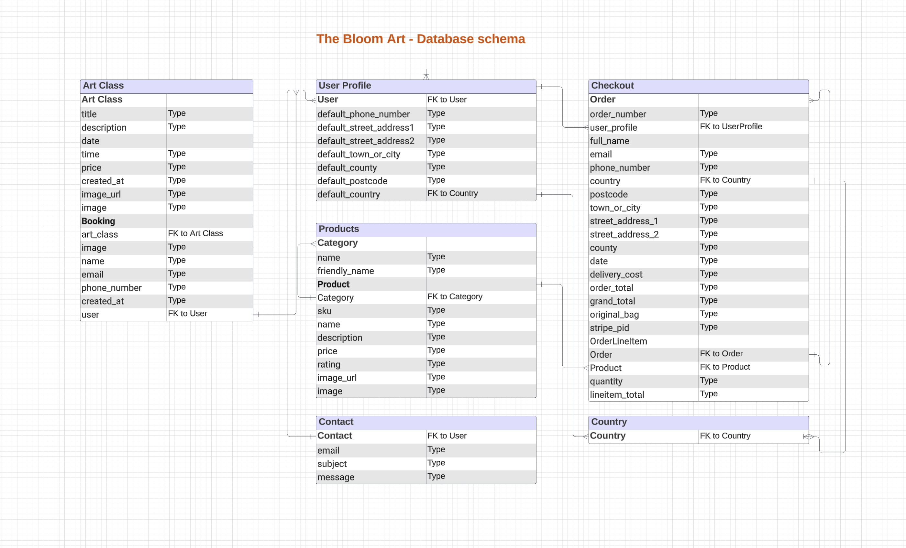

# ** The Bllom Art E-commerce Platform 🎨**

Welcome to The Bloom Art, a vibrant and user-friendly e-commerce platform specializing in watercolor prints. This project is developed as a part of the Full Stack Development course at Code Institute. 

## 🔗 [View the live project here.]()

---

## CONTENTS

* [User Experience](#user-experience-ux)
  * [Project Goals](#project-goals)
  * [User Stories](#user-stories)

* [Design](#design)
  * [Colour Scheme](#colour-scheme)
  * [Typography](#typography)
  * [Wireframes](#wireframes)
  * [Database Schema](#database-schema) 

* [Agile Development Process](#agile-development-process)

* [Features](#features)

* [Technologies Used](#technologies-used)
  * [Languages Used](#languages-used)
  * [Frameworks, Libraries & Programs Used](#frameworks-libraries--programs-used)

* [Testing](#testing)

* [Deployment & Local Development](#deployment--local-development)
  * [Remote Deployment](#remote-deployment)
  * [Local Deployment](#local-deployment)
    * [How to Fork](#how-to-fork)
    * [How to Clone](#how-to-clone)
    * [Using Gitpod](#using-gitpod)

* [Credits](#credits)
  * [Acknowledgments](#acknowledgments)
 

### Database Schema

