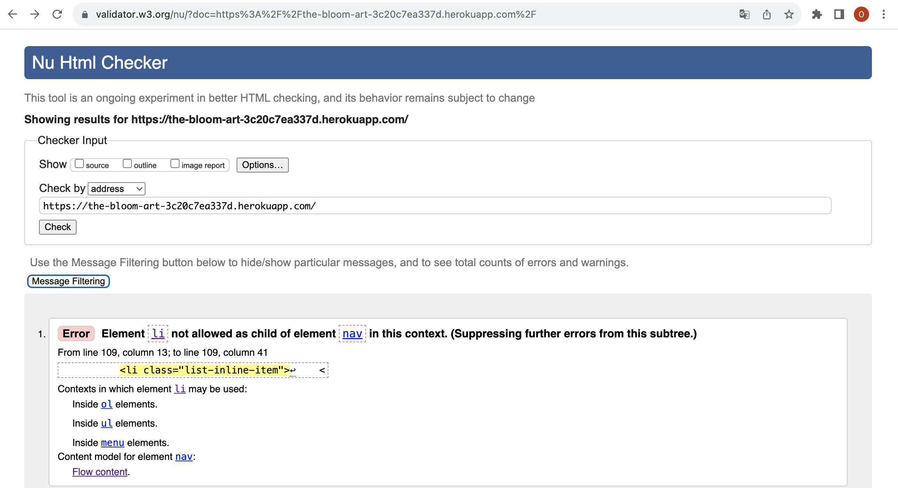
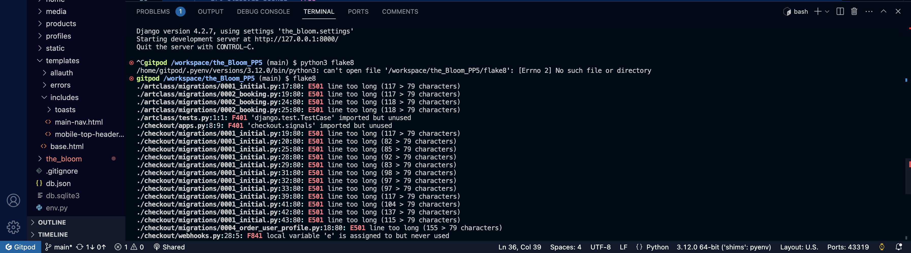
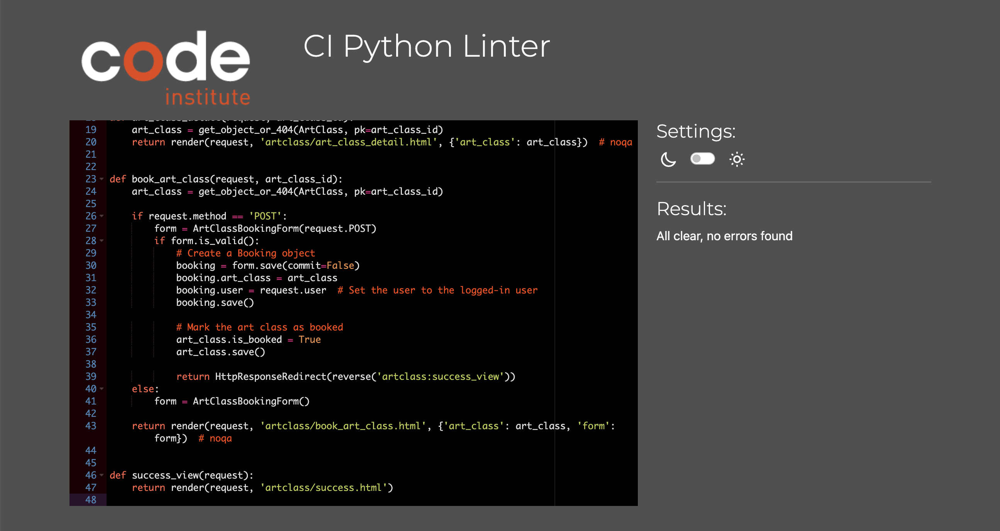
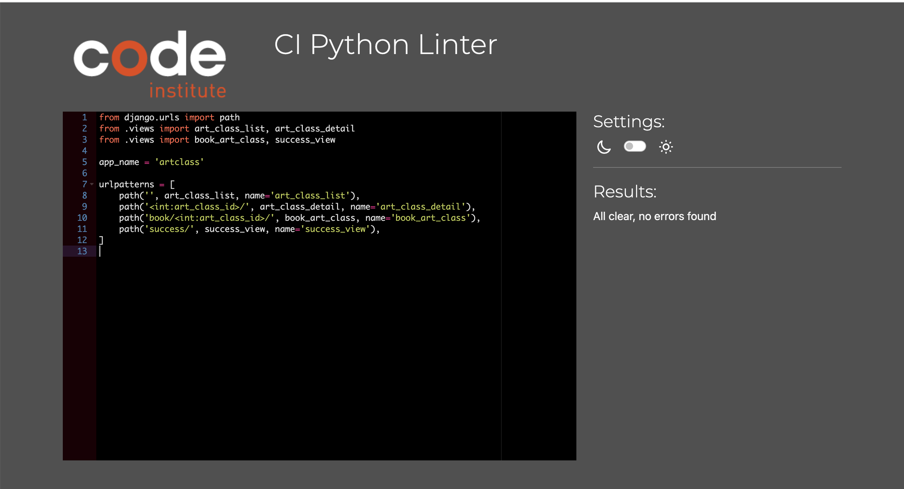
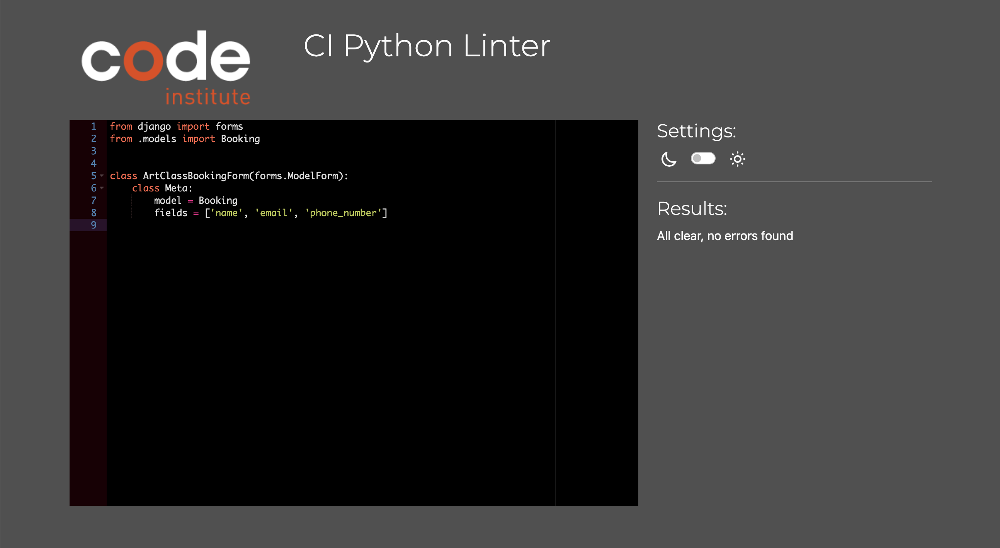
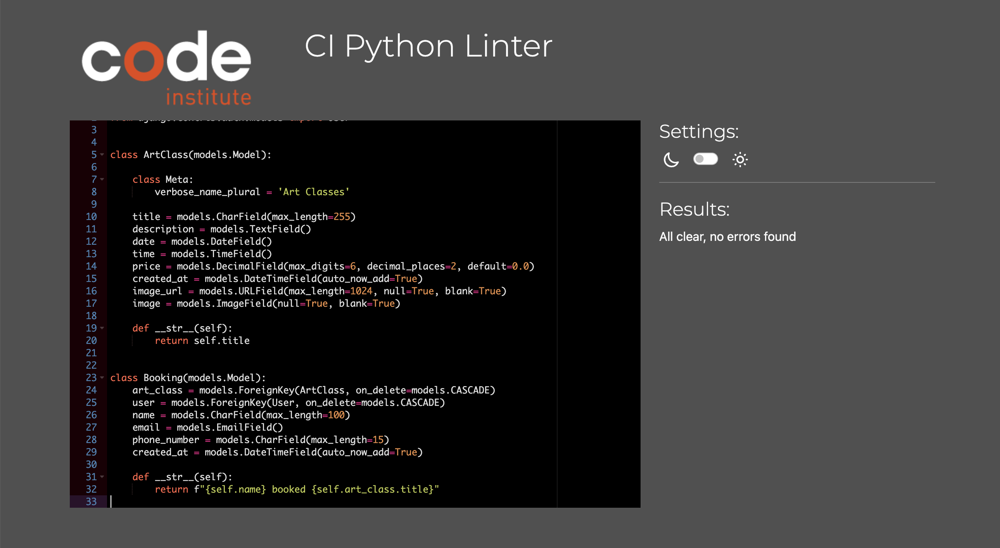
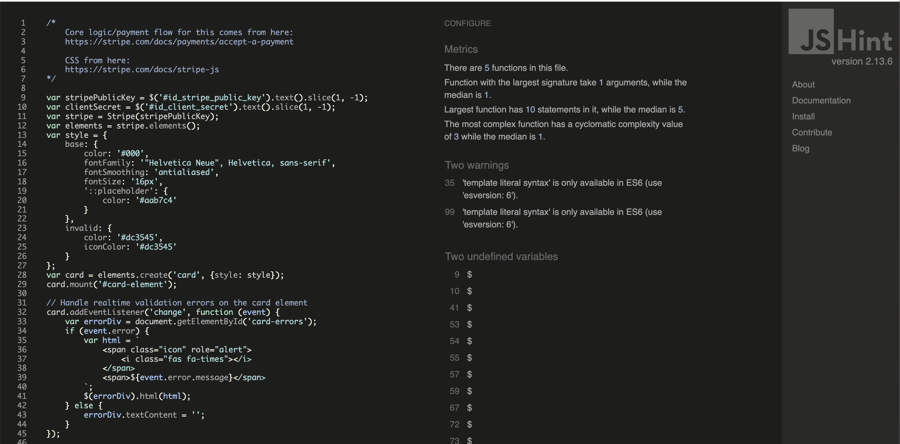
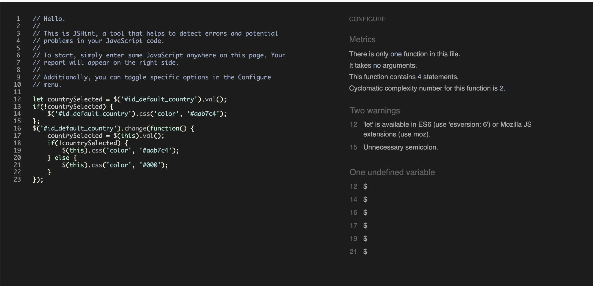
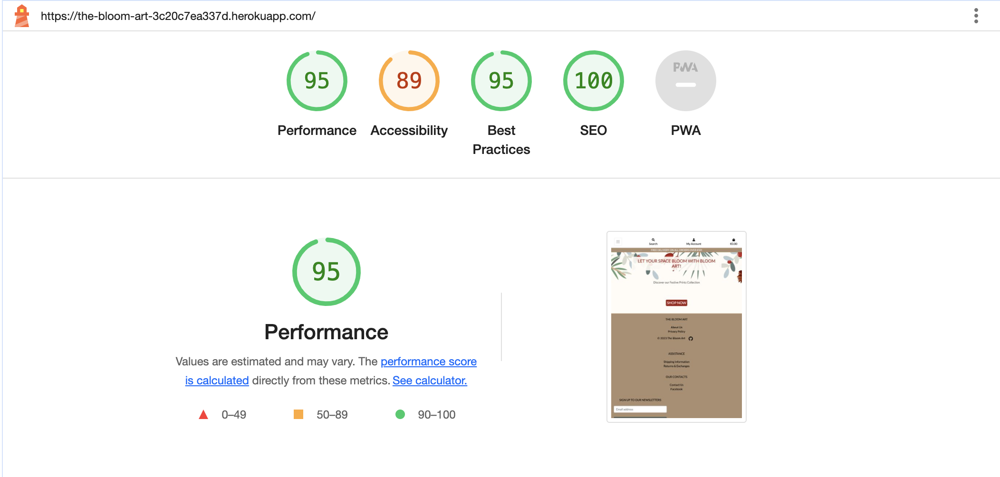

 <h1 align="center">The Bloom Art - Testing</h1>

## VALIDATION

## **HTML**

To check markup validity of Web documents as HTML, we used: [W3C Markup Validation Service](https://validator.w3.org/).
Unfortunately since Django tags are conflicting with standard HTML markup, we could not fix those errors.

HTML

---
 

## **CSS**

The CSS was checked on [Jigsaw Validator](https://jigsaw.w3.org/css-validator/) 

* Results from the [checkout](docs/testing/checkout_css.png) css.
* Results from the [profile](docs/testing//profile_css.png) css.
* Results from the [base](docs/testing//base_css.png) css.

---
 

## **PYTHON**

## **Flake8**

In Gitpod python was checked using flake8:

Flake8

## **CI Python Linter**

Also the Python was checked on CI Python linter:

artclass_views

artclass_urls

artclass_forms

artclass_models

---
 

## **JAVA SCRIPT**

To detect errors and potential problems in our JavaScript code we used: [JSHint](https://jshint.com/)

stripe

countryfield

---
 

## **LIGHTHOUSE**

I used Chrome Developer Tools Lighthouse to test the Performance, Accessibility, Best practices and SEO of this project.

---
 

## **DEVICE TESTING**

Website was tested on these available devices:

- Main working laptop: MacBook Pro (16-inch, 2019)
- Main smartphone: iPhone 11

Everything performed correctly:  
Loading website, navigating, opening links, shopping, authenticating as user or admin.. and finally, website behaved responsively on all devices.

---
 

## **MANUAL AND AUTOMATED TESTING**

Automated testing relies on scripts and tools to execute predefined test cases swiftly, providing fast and consistent results for regression testing. It requires a higher initial setup cost and is ideal for repetitive tasks. In contrast, manual testing involves human judgment and adaptability, making it effective for exploratory and usability testing. Manual testing may lack the repeatability of automated methods and has a lower initial learning curve. A balanced approach often combines both methods to maximize testing efficiency based on project requirements.

## **AUTOMATED TESTING** 

Automated testing will be implemented in next release

## **MANUAL TESTING**

`Nav Bar`

| Feature          | Expected Outcome                                        | Test Performed                                  | Result                           | Test Outcome |
|------------------|---------------------------------------------------------|-------------------------------------------------|----------------------------------|--------------|
| Logo             | Goes to home page .                                     | Click on the logo.                              | As expected                      | PASS         |
| Register         | Goes to the Signup when user is not logged in.          | Click on the Home menu item.                    | As expected                      | PASS         |
| Login            | Goes to the Login page.                                 | Click on the Login menu item.                   | As expected                      | PASS         |
| Shopping bag     | Goes to the Shopping bag page.                          | Click on the Shopping bag  icon.                | As expected                      | PASS         |
| Logout           | Goes to the Confirm Logout page when user is logged in. | Click on the Logout menu item.                  | As expected                      | PASS         |
| Search           | User can see search results                             | Enter any word in search field. Press Enter     | As expected                      | PASS         |
| Search           | User can see error message if he did not enter any data | Don't enter any data in seach field, press Enter| As expected                      | PASS         |
| About Us         | Goes to the About Us page.                              | Click on the About Us/About us link.            | As expected                      | PASS         |
| Shop All Products| The drop down list is opened.                           | Click on the Shopp All Products link.           | As expected                      | PASS         |
| Seasonal         | The drop down list is opened.                           | Click on the Seasonal link.                     | As expected                      | PASS         |
| Holidays/Events  | User can see error message if he did not enter any data | Don't enter any data in seach field, press Enter| As expected                      | PASS         |
| Art Classes      | The Art Classes page is opened.                         | Click on the Art Classes > Our Art Classes.     | As expected                      | PASS         |

`Home Page`

| Feature          | Expected Outcome                                        | Test Performed                                  | Result                           | Test Outcome |
|------------------|---------------------------------------------------------|-------------------------------------------------|----------------------------------|--------------|
| Shop Now Button  | Goes to the Christmas Collection page                   | Click on the Shop Now button                    | As expected                      | PASS         |

`Footer`

| Feature          | Expected Outcome                                        | Test Performed                                  | Result                           | Test Outcome |
|------------------|---------------------------------------------------------|-------------------------------------------------|----------------------------------|--------------|
| About Us         | Goes to the About Us page                               | Click on the About us link                      | As expected                      | PASS         |
| Privacy Policy   | Goes to the Privacy Policy page                         | Click on the Privacy Policy link                | As expected                      | PASS         |
| Shipping         | Goes to the Shipping information page                   | Click on the Shipping information link          | As expected                      | PASS         |
| Returns          | Goes to the Returns and Exchanges page                  | Click on the Returns and Exchanges link         | As expected                      | PASS         |
| Contact Us       | Goes to the Contact Us information page                 | Click on theContact Us information link         | As expected                      | PASS         |
| Facebook         | Goes to the Facebook page                               | Click on the Fecebooks link                     | As expected                      | PASS         |
| Subscribe        | User can subscribe to the newsletters                   | Enter email address. Press Subscribe button     | As expected                      | PASS         |
| Subscribe        | Thank you message after User has sudscribed             | Enter email address. Press Subscribe button     | As expected                      | PASS         |

`Products`

| Feature           | Expected Outcome                                        | Test Performed                                  | Result                           | Test Outcome |
|-------------------|---------------------------------------------------------|-------------------------------------------------|----------------------------------|--------------|
| All Products      | User can open All Products page                         | Click on the Shop All Products > All Products   | As expected                      | PASS         |
| Product Details   | Goes to the Product Details page                        | Click on the Product link                       | As expected                      | PASS         |
| Increment Quantity| The quantity is incremented by 1                        | Click on the "+" button                         | As expected                      | PASS         |
| Decrement Quantity| The quantity is decremented by 1                        | Click on the "-" button                         | As expected                      | PASS         |
| Add To Bag        | The Product is added to bag                             | Click on the Add to Bag button                  | As expected                      | PASS         |
| Continue Shopping | Goes to the All Products page                           | Click on the Continue Shopping button           | As expected                      | PASS         |
| Add to Bag        | "Product name" was added to bag message                 | Click on the Add to Bag button                  | As expected                      | PASS         |

`Shopping Bag`

| Feature           | Expected Outcome                                        | Test Performed                                  | Result                           | Test Outcome |
|-------------------|---------------------------------------------------------|-------------------------------------------------|----------------------------------|--------------|
| Added Products    | User can see All Added Products in Shopping Bag         | Open Shopping Bag                               | As expected                      | PASS         |
| Increment Quantity| The quantity is incremented by 1                        | Click on the "+" button                         | As expected                      | PASS         |
| Decrement Quantity| The quantity is decremented by 1                        | Click on the "-" button                         | As expected                      | PASS         |
| Continue Shopping | Goes to the All Products page                           | Click on the Continue Shopping button           | As expected                      | PASS         |
| Secure Checkout   | Checkout Form is opened                                 | Click on the Add to Secure Checkout             | As expected                      | PASS         |

`Checkout`

| Feature           | Expected Outcome                                        | Test Performed                                  | Result                           | Test Outcome |
|-------------------|---------------------------------------------------------|-------------------------------------------------|----------------------------------|--------------|
| Added Products    | User can see all Added Products in Shopping Bag         | Open Shopping Bag                               | As expected                      | PASS         |
| Increment Quantity| The quantity is incremented by 1                        | Click on the "+" button                         | As expected                      | PASS         |
| Decrement Quantity| The quantity is decremented by 1                        | Click on the "-" button                         | As expected                      | PASS         |
| Agjust Bag        | Goes to the Shopping Bag page                           | Click on the Adjust Bag button                  | As expected                      | PASS         |
| Submit form       | User can submit the checkout form                       | Fill all the requiered fields > Complete Order  | As expected                      | PASS         |
| Success Message   | "Order Prosessed + Your order number message is" shown  | Submit Checkout form                            | As expected                      | PASS         |

`Art Classes`

| Feature                       | Expected Outcome                                        | Test Performed                                  | Result                           | Test Outcome |
|-------------------------------|---------------------------------------------------------|-------------------------------------------------|----------------------------------|--------------|
| Art Classes list              | User can see all Aft Classes                            | Click on the Art Classes > Our Art Classes      | As expected                      | PASS         |
| Art Class Detail              | User can see all Aft Class details page                 | Click on the "More Info" button                 | As expected                      | PASS         |
| Book Art Class                | Book Art Class form is opened                           | Art Class > press "Book now" button             | As expected                      | PASS         |
| Book Art Class Form           | User can submit the Book Art Class form                 | Fill all the requiered fields > Book Now        | As expected                      | PASS         |
| Submit form                   | User can submit the checkout form                       | Fill all the requiered fields > Complete Order  | As expected                      | PASS         |
| Success Message               | Success page is shown after User submitted Booking form | Submit Boking form                              | As expected                      | PASS         |
| Back to Home page             | Goes to home page                                       | Submit Boking form > Press Back to Home page    | As expected                      | PASS         |
| Site Guest > Book Art Class   | Login page is opened                                    | Not logged in submit Boking form                | As expected                      | PASS         |

## **BUGS FIXED**

* server error 500 on deployed site after Site Guest booked the Art Class - [commit 0533323b2b8d2e52a95ada912e39e93d738e127a](https://github.com/ksumm/the_Bloom_PP5/commit/0533323b2b8d2e52a95ada912e39e93d738e127a)
