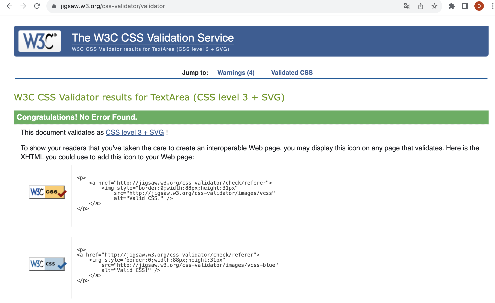
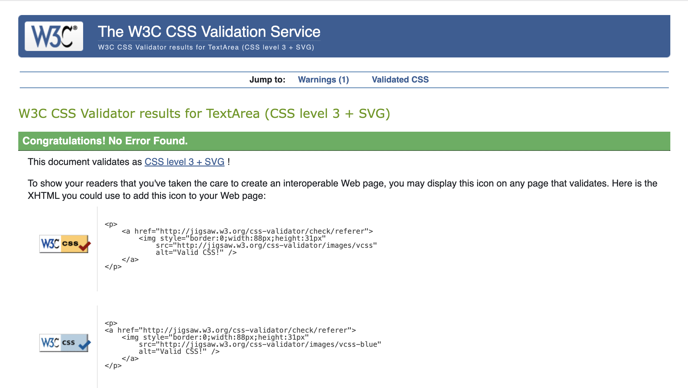
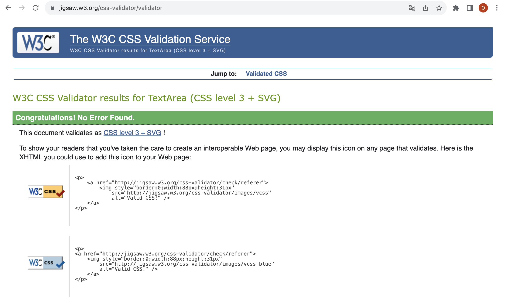

 <h1 align="center">The Bloom Art - Testing</h1>

## VALIDATION

### **CSS**

The CSS was checked on [Jigsaw Validator](https://jigsaw.w3.org/css-validator/) 

* Results from the [checkout](docs/testing/checkout_css.png) css.
* Results from the [profile](docs/testing//profile_css.png) css.
* Results from the [base](docs/testing//base_css.png) css.

    
base.css
 

    
checkout.css
 

    
profile.css
 

---
 

## **CI Python Linter**
The Python was checked on CI Python linter:

## **Lighthouse**

I used Chrome Developer Tools Lighthouse to test the Performance, Accessibility, Best practices and SEO of this project.

---
 

## MANUAL TESTING

`Nav Bar`

| Feature     | Expected Outcome                                        | Test Performed                              | Result                           | Test Outcome |
|-------------|---------------------------------------------------------|---------------------------------------------|----------------------------------|--------------|
| Logo        | Goes to home page                                       | Click on the logo on the top left.          | Goes to the home page.           | PASS         |
| Home        | Goes to home page when user is not logged in            | Click on the Home menu item.                | Goes to the home page.           | PASS         |
| Login       | Goes to the Login page.                                 | Click on the Login menu item.               | Goes to the login page.          | PASS         |
| Contact Us  | Goes to the Contact Us page.                            | Click on the Contact Us menu item.          | Goes to the Contact Us menu item.| PASS         |
| Logout      | Goes to the Confirm Logout page when user is logged in. | Click on the Logout menu item.              | Goes to the Confirm Logout page. | PASS         |
